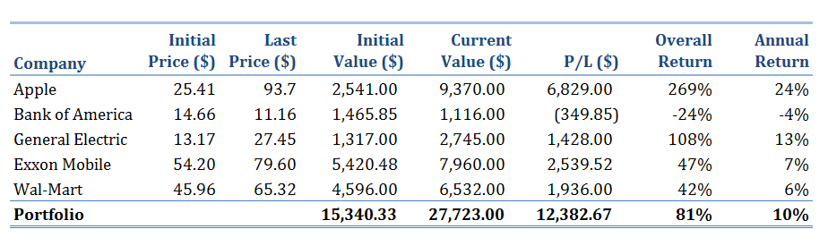
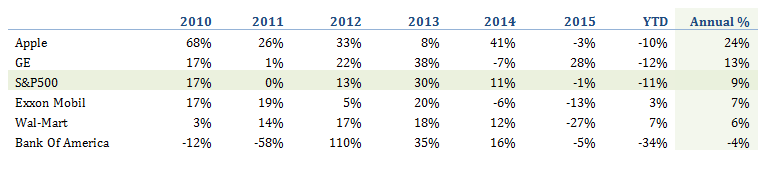
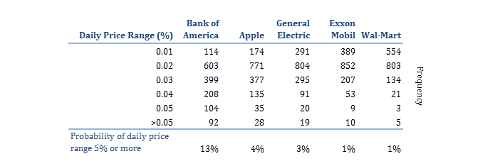
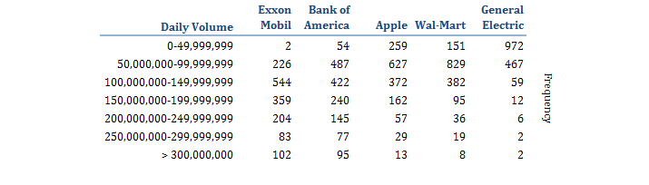
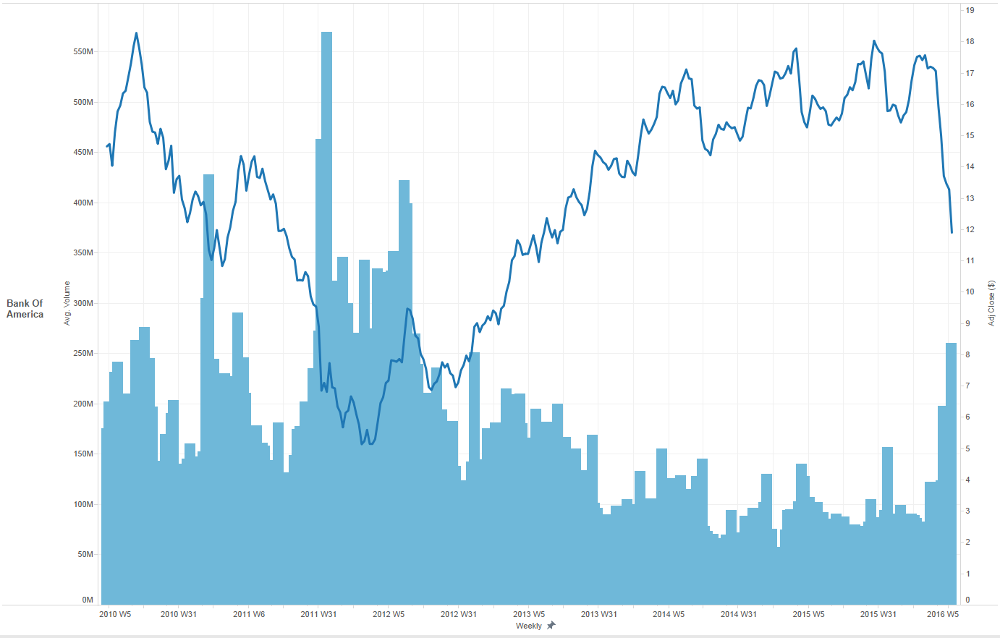
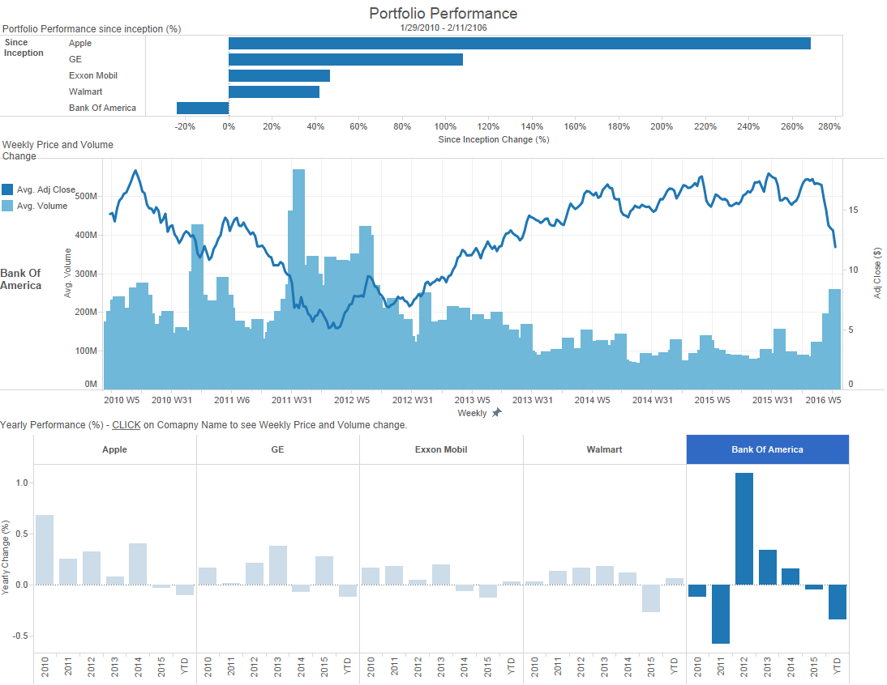

##Data, Measurements and Methodology:
*	All underlying financial data is from Yahoo Finance: <http://finance.yahoo.com/market-overview/>. 
*	The data ranges from 1/29/2010 until 2/11/2016
*	Where stock price is used for calculations, the “Adj Close” price is used, which is adjusted for dividends and splits. 
*	For simplicity sake, we use 100 shares for each company, as this is the smallest standard lot. 
*	Annual Return Percentage is calculated using geometric average AKA compound average.
*	For comparing returns on investment relative to market, S&P 500 is used.  First, because it is widely used index and second, all 5 companies are included in this index.
*	For daily price range, I adjusted daily high and low using the Adj close price before I used the numbers in calculations.

##The Portfolio:
On January 29, 2010 an investor bought equal shares of each five stocks: Apple, Bank of America, GE, Exxon Mobil, and Wal-Mart. For simplicity, our investor bought 100 shares of each stock. Below you will find a summary performance review, a closer look at how the portfolio is performing compared to S&P 500 Index, and some other aspects that are worth considering.     

##Performance Summary:
Initial investment of $15,340.33 has produced profits of   $12,382.67, resulting in current portfolio value of $27,723.00. The best performing stock was Apple, producing a whopping 269% total return, more than all the other stocks combined. The worst performing stock was Bank of America, loosing total of 24% of the initial value. Overall, the portfolio has almost doubled its value in the last 6 years, with a total return of 81%.  Annual return ranges from high of 24% for Apple, to the low of -4% for Bank of America. Table below shows the summary performance by company.   

##Annual Return Comparison:
The above summary paints a pretty rosy picture. If we look only at the very high level, everything seems to be going well. Looking a little closer, a different picture emerges. Next table shows annual return percentage per company. It also shows S&P 500 performance and annual return for the same period.  Only two of the five companies outperformed S&P 500 over the 6 year period.   

##Volatility:
One thing is annual return, another how it is achieved. Looking at price volatility and volumes, even clearer picture emerges.   Daily Price Range (Adj High – Adj Low) histogram shows us, that Bank of America, the worst performing per annual return comparison, is also the most volatile of the group. It had 13% likelihood that a trading day would turn out to be a large price swing day, price moving 5% or more.  This is 3 times higher chance than the next company in the list (Apple 4%) and more than 10 times higher than lowest two. 

For the group of stocks that we are following, the daily volume does not seem as strong indicator for the annual return. The most traded stock by daily volume, Exxon Mobile, had one of the least volatile price movements and average annual return.  Our worst performer, Bank of America, was second most traded by daily volume.  Here are the numbers:

Numbers in these tables do not tell the whole story.  When we are dealing with lots of data, in this data set we have 1520 trading days, graphs can help considerable.  See price and volume plotted for Bank Of America and how it is easier to put the numbers in tables into context after seeing the graph.

If you want even more visual representation of the data, I have created a small interactive dashboard that shows the total portfolio return, the above price volume chart and yearly performance by company. Interactive version is available at <https://public.tableau.com/profile/lilianne.raud#!/vizhome/VR3AS25CompanyPortfolio/PortfolioPerformanceDashboard> and a screenshot from the dashboard is at the end of this report.

##Summary:
*	The portfolio performed little better than the market, with overall annual return of 10% versus S&P 500 9%. 
*	Although overall the portfolio has done well, there are areas of concern. One of the top performers seems to be losing its steam. Apple, bringing in more than half of the total profit, has not been performing well last year. The start of the year does not seem to be improving matters.
*	If you are looking for lower volatility but still want to beat the market, General Electric might be your pick. It was the second best performing; it did not have many large volume days and had more than 3 times less volatile price moving days than our worst performer, Bank of America.
*	Bank of America was the worst performer- both in overall annual return and also as most volatile stock.
*	In conclusion, picking stocks, analyzing them and living with the daily volatility is hard work. Whether potentially beating the market by 1% is worth it, has to be decided by any individual investor by themselves.  

