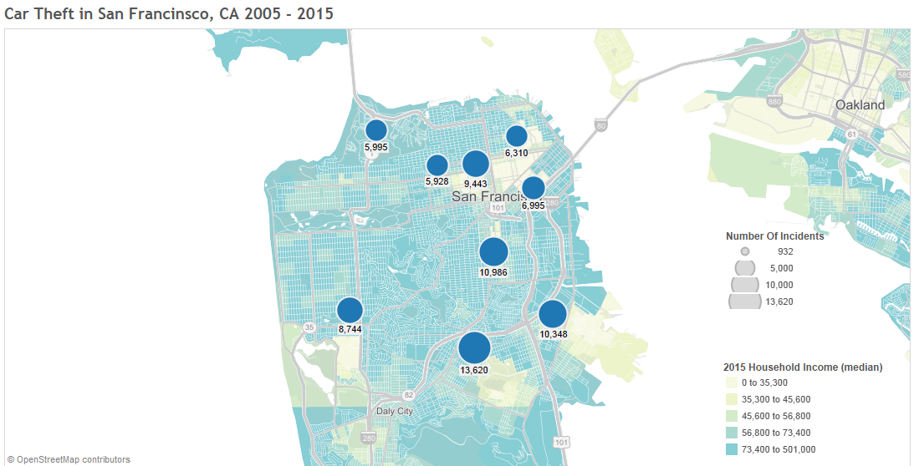

###Introduction:

This study analyzes car theft in San Francisco, CA and Raleigh, NC from 2005 - 2015. The study looks at number of incidents, when the incidents happened and where. It tries to find similarities and patterns. 

###Data:

Two data-sets were downloaded from <http://us-city.census.okfn.org/dataset/crime-stats>: All crimes from 2005-2015 for San Francisco, CA and all crimes for Raleigh, NC. Using the Category field, the correct category for car theft was determined and any data not pertaining to car theft was filtered out. In addition to crime data, US Census bureau population and household income data was used. More detailed description of data prep is in the methodology section.

###Findings:

Car theft as a crime is a very different problem in San Francisco, CA compared to Raleigh, NC. Car theft happens 4 - 10 times more frequently in San Francisco than in Raleigh, NC. Taking into consideration that the population of San Francisco is about double the population of Raleigh, NC, it still leaves the car theft rate  2 to 5 times higher in San Francisco.  

Raleigh seems to be doing better in other regards as well. Although the number of incidents per year has not decreased smoothly, the chart below shows, that the trend is down. Even more impressive is a fact, that the population has grown during that time, so overall the car theft rate has gone down even further than is evident from the incident count.

San Francisco has not fared as well. Looking at the chart below, it is clear that something dramatic happened between 2005 and 2006. The easiest would have been just to leave 2005 out. As an author of this study, I felt strongly that this might cover up some important follow up questions, so I left the data in. From trending purposes, if you exclude the first year, it seems like car theft is lightly increasing. Since the population is growing in San Francisco as well, the uptick might be explained by just that. 

There were two other variables that I used to compare car theft in the two cities: income and day of the week the crime happened. Again, the picture that emerges for the two cities, is very different.

The three most likely days you car will be stolen in Raleigh are Monday, Wednesday and Friday. 

The three most likely days your car will be stolen in San Francisco are Friday Saturday and Sunday. 

In Raleigh, most cars are stolen in low income neighborhoods. The underlying data used for analyses included coordinates which allowed to create the map below, that shows in which neighborhoods the crimes were reported. The size of the circle signifies the number of incidents. The colors on the map show household income as reported by US Census Bureau. 

In San Francisco, most cars are stolen on the edge of the low income neighborhoods, in a higher income area.

###Methodology:

The underlying data was pulled 02/27/2016 from <http://us-city.census.okfn.org/dataset/crime-stats>. There were total of 1,877,125 records in San Francisco file and 493,225 records in Raleigh file. 

* There were 39 Category descriptions in San Francisco file and only one sounded like car theft - "VEHICLE THEFT" - which was used to filter out other crimes.
* There were 427 Category descriptions in Raleigh file. The following were deemed to belong to car theft - "MV THEFT/AUTOMOBILE", "MV THEFT/OTHER VEHICLES", "MV THEFT/TRUCK OR BUS" and "Motor Vehicle Theft" which were used to filter out other crimes.
* After filtering, the final dataset for analyses included for 10,689 records for Raleigh and 79,754 records for San Francisco.
* Added a new field WeekDay, calculated from date, to do weekday analyses
* Separated Location coordinates to Longitude and Latitude fields, so could be used for mapping.
* Added population values for each year. Data was obtained from several different online sources, all siting that this was US Census data.

###Final Note:

The task of the assignment was to describe similarities. I was not able to find any. Opposite, and interesting picture emerged. This is purely speculation, but based on the above data, here how I see the two cities:

Raleigh, NC: Fast growing region with working class neighborhoods. Crime is being addressed and is going down. Most cars are stolen close to home and it might be very well by desperate soles that do not have other means to get to their jobs.

San Francisco, CA: A tourist destination that has either stable or slightly growing trend for car theft. Most cars are stolen over the weekend in more affluent neighborhoods, just outside lower income areas. If that does not cry out "joy ride"", then I do not know what would.

When it comes to San Francisco, CA, it seems that after 2005, they changed how car theft was reported, that is my current explanation to the large change that did not happen in following years. Of cause, to know for sure, further investigation needs to be done.

