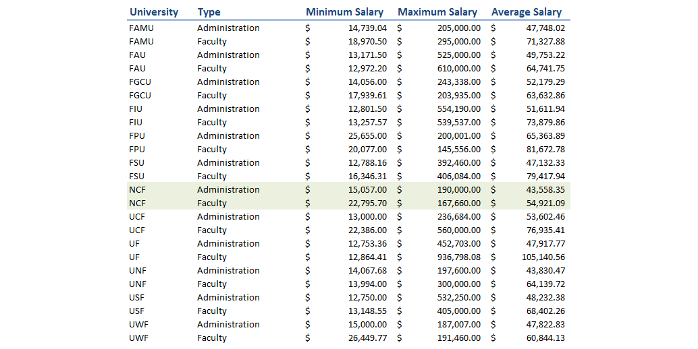

##Data

The underlying data is from <https://prod.flbog.net:4445/pls/apex/f?p=140:1:0:::::>. Following steps were taken before data was analysed:

* New field, Full_name was created:  concaconate First_Name and Last_Name. 
* New field, ClassType was created: titles including words PROFESSOR, INSTRUCTOR, LECTURER, SCHOLAR were assigned to faculty, rest were deemed to belong to administration.
* New field, Actual_Salary was created: multiplying Actual_Salary by FTE.
* New Data Set was Created: Combining employee actual salary from different sources into one salary.

  CREATE TABLE summary_university_salaries
  SELECT University, Full_Name, Class_Title, SUM(FTE) AS FTE, ROUND(SUM(Actual_Salary),2) AS CombinedActualSalary, ClassType,   
  COUNT(Actual_Salary) AS CountofSalarySources FROM university_salaries
  WHERE Annual_Salary IS NOT NULL
  GROUP BY University, Full_Name, Class_Title;

* From the new data source, employees with less than 0.5 FTE and employees with less than $ 12,500 Actual_Salary were deleted, as assumption was made that these were not full time employees and would "slant" the analyses.
* All OPS amounts were excluded, as those denote temporary employment compensation.

##Analyses

First, lets look at the summary table that shows minimum, maximum and average salaries for both administration and faculty for all 12 universities. 

There is lots of data, and it is not so easy to parse to understand, what it really means. So lets look a little closer to the data as bar graphs. First, lets look what story does the Maximum Salary graph tell us:

It is obvious that something is going on at UF. Their maximum salary is 30% higher than the next university, FAU and whopping 80% higher than the lowest - FPU and NCF. 

Lets take a look at the Average Salary:

Interestingly enough, on average, faculty salaries are larger than administration salaries. New College is still dead last, having the lowest average salaries.

Finally, lets see what minimum salaries look like?

Here is our picture completely reversed. Universities who lagged behind with maximum and average salaries have the highest minimum salaries. NFC is the 2nd best in this category and UF is dead last. 

New College, internally shows, that although minimum and average salaries for faculty are larger than for administration, the highest paid employees are in administration, as the table above clearly shows. 

Overall, this data is not vetted, studied or analysed enough to make any conclusions. It is good start to ask some interesting questions tho. 

NOTE: UF salaries were very much out of the norm, with some salaries reaching close to $ 1,000,000.00. Although attempt was made to try to confirm if these salaries are actually computed and reported on the same bases as other universities, the time allowed for the assignment, did not allow this research to be completed. Hence, these salaries were left into the data sample as is.